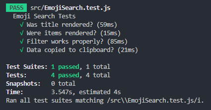
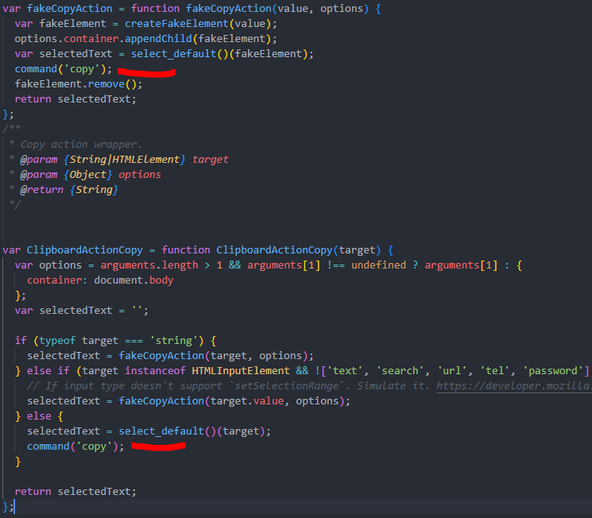
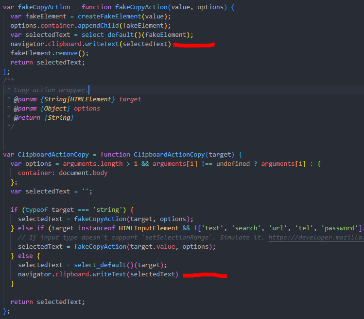

# Emoji Search Testing

To test app which have already developed works properly or not.

I have changed clipboard/dist/clipboard.js module file to catch copied data. Check screenshot section to see the change I have made.

Install
---

`npm install`

Usage
---

`npm start`

Test
---

`npm run test`

Screenshots
---

Replace

` command("copy") `

lines with

` navigator.clipboard.writeText(selectedText) `

