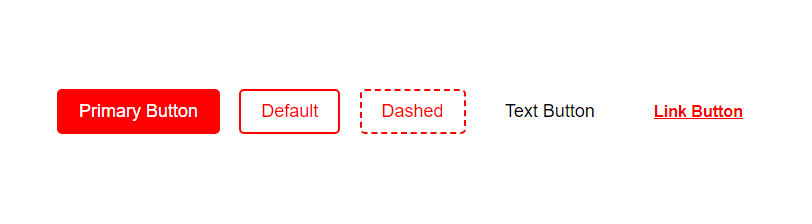

# Machui

> Just for assignment

> Made with create-react-library

[](https://www.npmjs.com/package/machui) [](https://standardjs.com)

## Install

```bash
npm install --save machui
```

## Usage

**types: primary, dashed, text, link**

```jsx
import React, { Component } from 'react'

import Button from 'machui'
import 'machui/dist/index.css'

class Example extends Component {
  render() {
    return <Button type="primary" />
  }
}
```



## License

MIT © [freryksl](https://github.com/freryksl)
